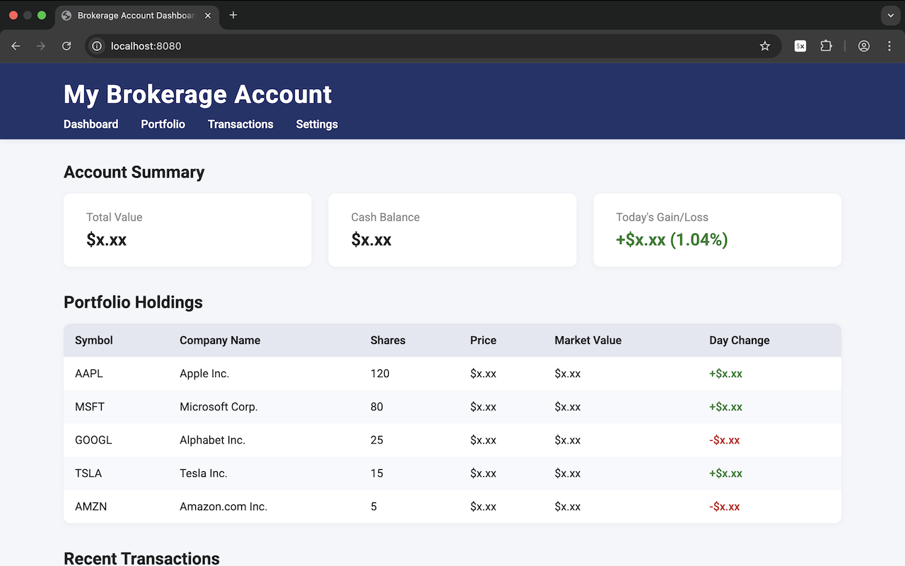
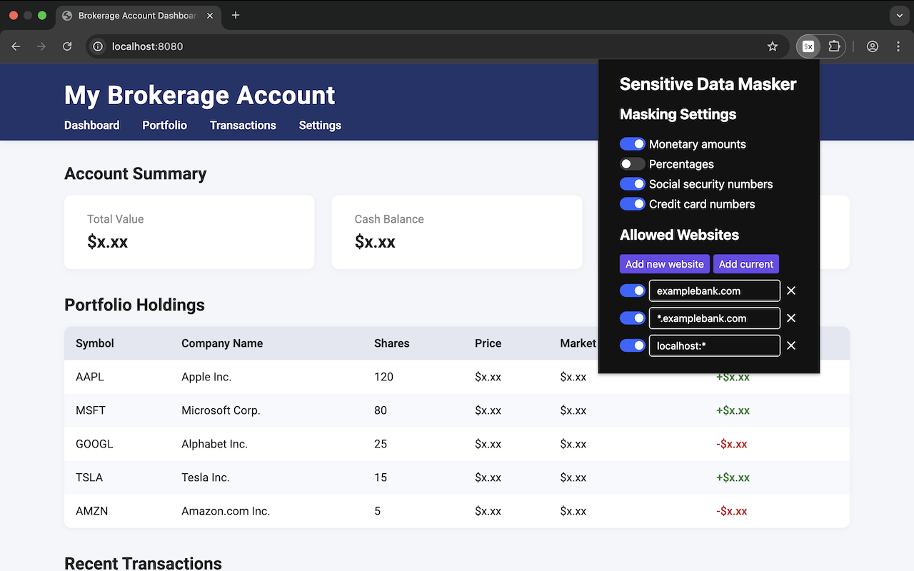

# Sensitive Data Masker

_Copyright 2025 Caleb Evans_  
_Released under the MIT license_

Sensitive Data Masker is a Chrome extension that masks the values of sensitive
information like monetary amounts, social security numbers, and other sensitive
values. This is useful if you want to show someone a webpage without revealing
the sensitive information on it.

## How to use

1. **Add the extension to Chrome**  
   After installing the extension, the icon will be added to the Chrome
   Extensions menu (puzzle piece icon in the toolbar). To make it easier to
   access, you can pin the icon:

   - Click the Extensions menu (puzzle piece icon) in the Chrome toolbar.
   - Find "Sensitive Data Masker" in the list and click the pin icon next to it.

2. **Open the Options page**  
   Click the extension icon in the toolbar (or from the Extensions menu) to open
   the options page.

3. **Add websites to the allowed list**  
   On the Options page, you can manage the list of websites where sensitive data
   masking will be applied:

   - Click **"Add new website"** to add a blank entry. You can then type the
     hostname or URL of the website you want to allow; wildcards (`*`) are
     supported (e.g. `*.mywebsite.com`)
   - Click **"Add current"** to quickly add the website under the active tab.

   You can also add a website to the allowed list by right-clicking the webpage,
   choosing "Sensitive Data Masker" from the menu, and then clicking "Add
   Current".

4. **Enable or disable masking for specific websites**  
   Use the toggle switch next to each website in the list to enable or disable
   masking for that specific website without removing the entry.

5. **Edit or remove websites**

   - To edit a website, click the input field and update the hostname or URL
     pattern.
   - To remove a website, click the X icon next to it.

6. **Changes are autosaved**  
   Changes are automatically saved as you add, edit, or remove websites. Just remember to reload the current page to see changes there.

7. **Disable masking temporarily**  
   If you want to temporarily disable masking for all websites, you can toggle
   the extension off from the Chrome toolbar by clicking the extension icon and
   using the provided controls.

8. **Toggle visibility of certain data types**: At the top of the extension
   popup, you will see a list of the various data types that can be
   automatically masked by the extension. Toggling the switch for any data type
   will change whether it is currently masked (enabled means values will be
   masked, whereas disabled means those values will be visible).





## Developer Setup

### Build project

Once you've cloned the project, you must install dependencies and build the
extension using your preferred package manager (like npm, yarn, or pnpm):

```sh
pnpm install
pnpm build
```

### Install from Chrome

Once the extension is built, open [chrome://extensions](chrome://extensions) and
enable **Developer mode** in the top-right corner.

Once you see the Developer Mode toolbar appear, click the "Load unpacked"
button, then choose the `dist/` directory in the repository.
